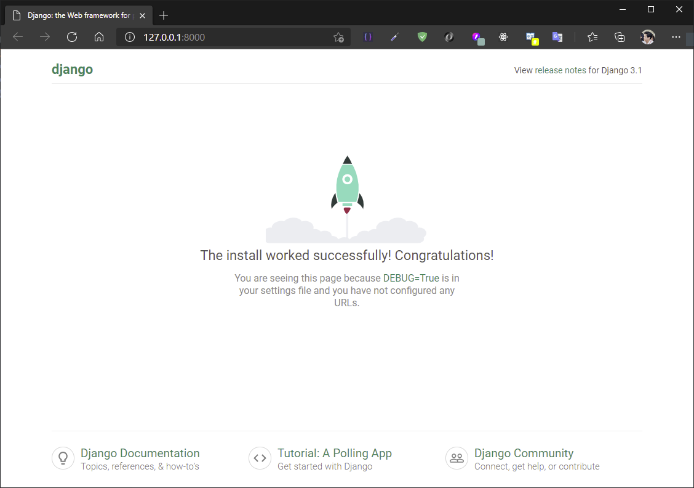

# Tạo dự án Django

## Tạo một dự án Django

Tạo dự án Django mới, có tên là `samplesite` bằng lệnh:

```bash
$ cd ~/django-notes
~/django-notes
$ source venv/Scripts/activate
(venv) ~/django-notes
$ django-admin startproject samplesite
```

Cấu trúc dự án `samplesite` như sau:

```
django-notes
    samplesite
        samplesite
            __init__.py
            asgi.py
            settings.py
            urls.py
            wsgi.py
        manage.py
```

- `manage.py`: cung cấp các lệnh giúp ta thao tác với dự án Django
- `samplesite`: thư mục cùng tên với tên dự án - là một gói (*package*) chứa các mô-đun liên quan đến toàn bộ dự án và chứa các cài đặt cho toàn bộ dự án (cụ thể là mô-đun `settings.py`). Tên của gói này bắt buộc phải cùng tên với dự án, bạn không nên thay đổi nó. Vì tên dự án bị thay đổi từ dự án này sang dự án khác, nên ta gọi chung gói này là *gói cấu hình*. Bên trong gói cấu hình này, ta có các mô-đun sau:
  - `__init__.py`: một tệp trống, nói cho Python biết rằng, thư mục chứa nó là một gói hoàn chỉnh.
  - `settings.py`: mô-đun chứa các cài đặt chính của dự án.
  - `urls.py`: mô-đun chứa các URL của dự án.
  - `wsgi.py`: mô-đun kết nối dự án với một máy chủ web bằng WSGI interface.
  - `asgi.py` (có từ Django 3.0): mô-đun kết nối dự án với một máy chủ web bằng ASGI interface.

Các mô-đun `wsgi.py` và `asgi.py` được sử dụng khi xuất bản trang web hoản chỉnh lên Internet.

Gói cấu hình lưu trữ các cài đặt cho toàn bộ dự án và ảnh hướng đến tất cả các ứng dụng của đự án.

Chúng ta có thể di chuyển thư mục dự án đi bất cứ đâu trên hệ thống file của máy tính. Chúng ta cũng có thể thay đổi tên của thư mục dự án. Hoạt động của dự án không bị phụ thuộc vào vị trí và tên của thư mục chứa dự án.


## Máy chủ web gỡ lỗi

Django đi kèm với một máy chủ web dùng để gỡ lỗi trong quá trình phát triển dự án được viết bằng chính ngôn ngữ Python. Để chạy nó, ta dùng lệnh `runserver` được cung cấp bởi `manage.py`:

```bash
(venv)
cd ~/django-notes
$ cd samplesite
(venv) ~/django-notes/samplesite
$ python manage.py runserver
```

Nếu mã bạn viết không có lỗi gì, một thông báo được hiển thị, thông báo này cho biết rằng trang web đã được khởi chạy thành công và có sẵn tại địa chỉ `http://127.0.0.1:8000/` (hoặc `http://localhost:8000/`). Như bạn đã thấy, máy chủ gỡ lỗi hoạt động mặc định ở cổng TCP 8000 (tuy nhiên bạn có thể sử dụng một cổng khác, nếu cần).

Hãy khởi động trình duyệt web và nhập một trong hai địa chỉ trên. Chúng ta sẽ thấy một trang web do chính Django cung cấp:




Để dừng máy chủ gỡ lỗi này, bấm tổ hợp phím `Ctrl + C`.
