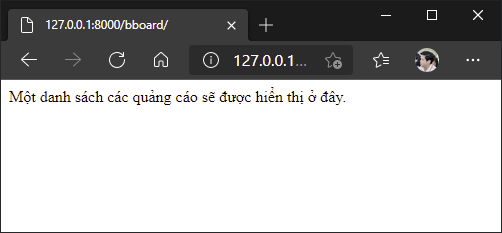

# Định tuyến trong Django

Rất dễ để định tuyến trong Django:

- Khai báo sự liên kết của một đường dẫn có định dạng cụ thể (đường dẫn mẫu) với một controller cụ thể - nói cách khác là khai báo một *route*.
  Đường dẫn là một phần của địa chỉ Internet nằm giữa địa chỉ máy chủ và tập hợp các tham số GET (ví dụ: địa chỉ internet `http://localhost:8000/bboard/34/edit/` chứa đường dẫn là `bboard/34/edit`).

  Đường dẫn mẫu phải kết thúc bằng dấu gạch chéo. Ngược lại, không được bắt đầu đường dẫn bằng dấu gạch chéo.
- Sắp xếp các route do chúng ta khai báo dưới dạng danh sách.
- Sắp xếp các route theo một định dạng nghiệm ngặt để hệ thống định tuyến của Django có thể hiểu và sử dụng.

Bất cứ khi nào có bất kỳ yêu cầu nào đến từ khách hàng, Django sẽ trích xuất địa chỉ từ đối tượng `request` và truyền cho bộ định tuyến. Bộ định tuyến sau đó so sánh tuần tự địa chỉ với các đường dẫn mẫu lấy từ danh sách các route. Ngay khi thấy khớp với một đường dẫn mẫu nào đó, bộ định tuyến chuyển quyền điều khiển cho controller được liên kết với đường dẫn mẫu ấy.

Nên khi một yêu cầu được thực hiện qua địa chỉ `http://localhost:8000/bboard/`, muốn controller `index()` chạy, chúng ta cần liên kết controller này với một đường dẫn mẫu thích hợp, đó là `bboard/`.

Các đường dẫn của dự án được lưu trữ trong mô-đun `urls.py` của gói cấu hình ứng dụng. Mở mô-đun `urls.py` này trong trình soạn thảo, và xem nó chứa những gì:

```python
from django.contrib import admin
from django.urls import path

urlpatterns = [
    path('admin/', admin.site.urls),
]
```

Danh sách các route được định dạng như một danh sách Python, được lưu trong biến `urlpatterns`. Mỗi phần tử của danh sách phải được biểu diễn như kết quả trả về của `path()` được lấy từ mô-đun `django.urls`. `path()` nhận một đối số là chuỗi biểu diễn đường dẫn mẫu và một đối số khác là controller liên kết với đường dẫn mẫu.

Bạn cũng có thể chuyển danh sách route của ứng dụng làm đối số thứ hai của `path()` như trong dòng lệnh:

```python
path('admin/', admin.site.urls)
```

Bây giờ, hãy thêm một route mới vào danh sách `urlpatterns`, kết nối đường dẫn mẫu `bboard/` với controller `index()`.

```python
from django.contrib import admin
from django.urls import path

from bboard.views import index

urlpatterns = [
    path('bboard/', index),
    path('admin/', admin.site.urls),
]
```

Lưu lại, khởi động máy chủ gỡ lỗi và nhập địa chỉ `http://localhost:8000/bboard/` vào trình duyệt web của bạn. Chúng ta sẽ thấy văn bản thông báo được trả về bởi controller của chúng ta.



Khi số route trở nên nhiều hơn, cách tiếp cận này trở nên không tốt, khi tất cả các route của toàn dự án đều được viết trong mô-đun `urls.py` cấp dự án.

Như đã đề cập ở trên, hàm `path()` cho phép bạn chỉ định trong tham số thứ hai của nó một tham chiếu đến danh sách các route của ứng dụng thay vì một controller.

Theo cách này, ta nên chia các route theo các ứng dụng, `urls.py` cấp dự án chỉ là nơi chỉ định các đường dẫn cơ sở của mỗi ứng dụng. Các đường dẫn cụ thể của mỗi ứng dụng nên được chỉ định trong `urls.py` của nó.

Hãy bắt đầu với danh sách các route cấp ứng dụng `bboard` của chúng. Tạo trong gói này mô-đun có tên `urls.py` và thêm mã sau vào đó:

```python
from django.urls import path

from .views import index

urlpatterns = [
    path('', index),
]
```

Cuối cùng, sửa mã mô-đun `urls.py` cấp dự án như sau:

```python
from django.contrib import admin
from django.urls import path, include

urlpatterns = [
    path('bboard/', include('bboard.urls')),
    path('admin/', admin.site.urls),
]
```

Danh sách các route được chỉ định trong tham số thứ hai của `path()` phải là kết quả được trả về bởi hàm `include()` từ mô-đun `django.urls`. Hàm này nhận một đối số duy nhất là một chuỗi với đường dẫn tới mô-đun `urls.py`, nơi danh sách các route của ứng dụng được khai báo.

Ngay khi nhận được một yêu cầu từ địa chỉ `http://localhost:8000/bboard/`, bộ định tuyến sẽ phát hiện ra rằng đường dẫn trong đó khớp với đường dẫn mẫu `bboard/` trong `urls.py` cấp ứng dụng. Nó xóa đường dẫn mẫu này khỏi đường dẫn lấy được từ địa chỉ, kết quả đường dẫn chỉ còn lại một chuỗi trống. Đường dẫn mới này (chuỗi trống `''`) sẽ khớp với đường dẫn mẫu trong `urls.py` cấp ứng dụng và controller `index()` sẽ được chạy và gửi thông báo về trình duyệt.

Điều tương tự xảy ra với đường dẫn thứ hai trong `urls.py` của dự án:

```python
path('admin/', admin.site.urls)
```

Ở đây `admin.site.urls` là các route của AdminSite, nó là trường hợp duy nhất ta không cần sử dụng `include()`.
